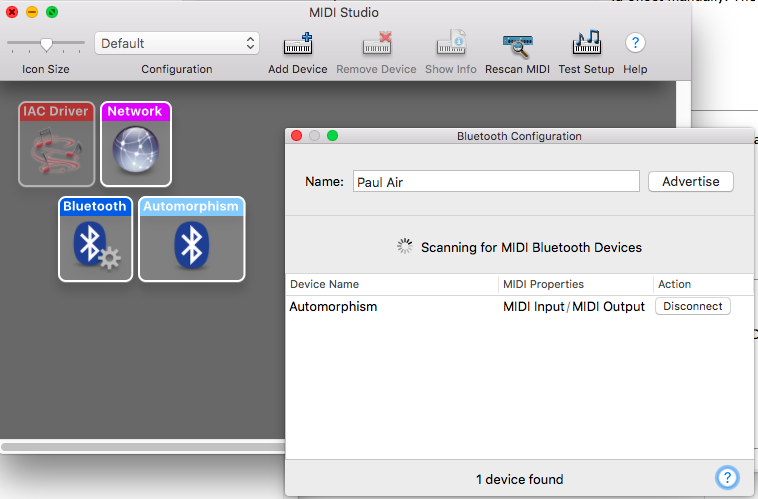
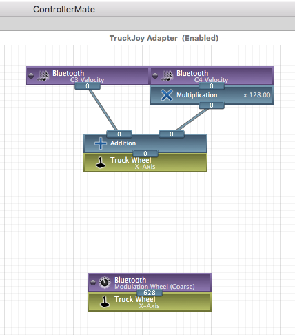

# TruckJoy
Use an iPhone/iPad to steer in American Truck Simulator.

This is a 1-day hack project.  I started playing American Truck Simulator recently, but I don't have a suitable controller.

Meanwhile, I noticed that with Core Motion, the iPhone/iPad's sensors provides exceptionally fine positional data.  Maybe I could use an iPhone as a steering wheel & custom controller?

The quick and dirty solution I came up with involves the following very simple components:

1. Core Motion
2. Core MIDI via Bluetooth
3. ControllerMate

### Core Motion

_CMMotionManager_ provides simple access to device's physical motion sensor fusion data, and here I'm just using the yaw rotation.

The only complication here is that I need to keep track of full rotations and offset manually.  The yaw's range is from -π to π (half circle backward to half circle forward).

### MIDI via Bluetooth

Turns out this is extremely easy.  Just present a _CABTMIDILocalPeripheralViewController_ on iOS, and the built-in _Audio MIDI Setup_ on the Mac, and connect.

Bonus feature of communicating via Bluetooth MIDI is its low latency.

### Sending motion data as MIDI message

Core MIDI is a pain to use because of its C API, and usig Swift only make it harder.

Fortunately with the _[PGMidi]_ library it's again fairly painless.  Though, some understanding of MIDI is required here.

### Converting MIDI to Virtual Joystick

At this point you're getting MIDI message on the Mac sent from iOS.  The last super secret sauce is _[ControllerMate]_.

With El Capitan, it's not a simple task to create a virtual HID.  ControllerMate does it for you and more.  ControllerMate listens to all the MIDI messages, and you can visually program it to map the MIDI messages to virtual joystick output axes.

At first I split the joystick value (0~4095) as two notes (C3 & C4) and re-combine them, as shown in the top half, since a note's velocity is only 7-bit.  Later it was changed to use the 14-bit modulation wheel instead.  By the way, I've been using ControllerMate since 2007 and it's one of my favorite application of all time.

### Demo

Here's [me driving a truck with an iPad Pro as the steering wheel].

[PGMidi]: https://github.com/petegoodliffe/PGMidi
[ControllerMate]: http://www.controllermate.com
[me driving a truck with an iPad Pro as the steering wheel]: https://www.youtube.com/watch?v=sD6ko1-xa88
